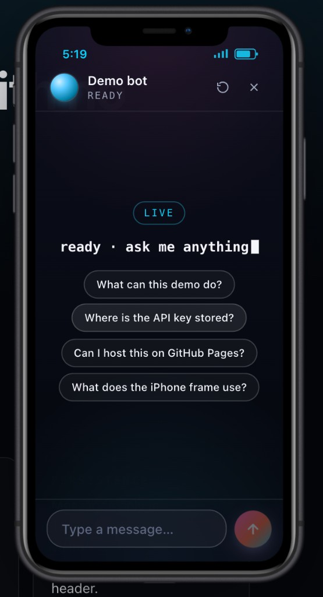

<h1 align="center">Best free business AI chatbot — drop-in, ready to go (2026)</h1>

<p align="center">
  <strong>One HTML file · streaming AI in an iPhone frame · no visitor API key</strong><br/>
  Built for small business sites that want a real chat assistant without the SaaS lock-in.
</p>

<p align="center">
  <a href="https://publishd.app/chat-demo.html"></a>
  <a href="https://console.groq.com/"></a>
  
  
</p>

<p align="center">
  <a href="https://publishd.app/chat-demo.html">
    
  </a>
</p>

<p align="center">
  <em>Single .html file. Glass FAB → iPhone-framed chat panel → streaming answers.</em>
</p>

---

## Watch it run (30 seconds)

> **Drag your `.mp4` here when editing the README on GitHub** — GitHub will upload to its CDN and replace this line with a `<video src="...">` tag automatically.
> Or: upload a `.mp4` to a [GitHub release](https://github.com/HeavenFYouMissed/best-free-business-ai-chatbot-ready-to-go-2026/releases/new) and paste the asset URL into the `src=""` below.

<!--
<video src="REPLACE_WITH_RELEASE_ASSET_URL.mp4" controls width="640" muted playsinline poster="docs/images/chat-widget-preview.png">
  Your browser doesn't render embedded video — <a href="REPLACE_WITH_RELEASE_ASSET_URL.mp4">download the demo here</a>.
</video>
-->

---

## What this is

A **production** chat surface I install on client websites — extracted as a single static HTML file that anyone can host. The widget POSTs to a tiny streaming endpoint (`/api/chat`) so visitors **never see or paste an API key**. Your Groq credential lives only in server environment variables, the same way the live site at [publishd.app](https://publishd.app) runs.

- **One file** — `public/chat-demo.html`. No bundler, no React, no framework.
- **Real iPhone bezel** — transparent PNG, embedded as base64.
- **Streaming text** — token-by-token, same backend as the in-app assistant.
- **Server-held key** — Groq stays on the server. Free tier is plenty for a brochure site.
- **Falls back gracefully** — offline / blocked → short canned reply, never a broken UI.

## Try it in 60 seconds

| Step | Action |
|------|--------|
| 1 | `git clone` this repo and run `npm install` |
| 2 | Add `GROQ_API_KEY` to `.env.local` ([create a free Groq key](https://console.groq.com/)) |
| 3 | `npm run dev` → open **http://localhost:3000/chat-demo.html** |

For live, hosted: visit **[publishd.app/chat-demo.html](https://publishd.app/chat-demo.html)**.

## Embed on another site

Drop the file on **any static host** (GitHub Pages, Netlify, S3, plain Apache):

```html
<iframe src="https://publishd.app/chat-demo.html" style="border:0;width:100%;height:100vh"></iframe>
```

…or open it directly. It will POST to `https://publishd.app/api/chat` (or your fork's URL after deploy).

For cross-origin embeds, set **`CHAT_WIDGET_ALLOWED_ORIGINS`** on the API host:

```bash
# Cloudflare Workers (this project)
npx wrangler secret put CHAT_WIDGET_ALLOWED_ORIGINS
# value: *    (any site)
# value: https://your-site.com,https://www.your-site.com   (allowlist)
```

Same-origin (`publishd.app`, `localhost:3000`) needs **no** CORS config.

## Environment variables

| Variable | Required | Purpose |
|----------|----------|---------|
| `GROQ_API_KEY` | Yes | Server-side Groq inference |
| `CHAT_WIDGET_ALLOWED_ORIGINS` | Only for cross-origin embeds | CORS allowlist or `*` |
| `INTAKE_WEBHOOK_URL` | Optional | Forward chat transcripts somewhere |
| `NEXT_PUBLIC_SITE_URL` | Optional | Used in OG / canonical tags |

**Never put `GROQ_API_KEY` in the HTML file or client JS.** The point of this widget is that the key stays server-side.

## RAG / your own knowledge

The default API route streams from Groq with a fixed system prompt. **Retrieval (RAG) is not included out of the box** — add it in `app/api/chat/route.ts`:

1. Embed your docs (pgvector, Cloudflare Vectorize, Pinecone — your call).
2. On each request, retrieve top-k chunks for the latest user message.
3. Prepend those chunks as a `system` message before the model call.

Full notes: **[`docs/chat-widget-setup.md`](docs/chat-widget-setup.md)**.

## Project layout

```
public/chat-demo.html        ← the widget (single file, share / embed this)
app/api/chat/route.ts        ← streaming proxy (server-held key + CORS)
lib/groq.ts                  ← Groq client + system prompt
docs/chat-widget-setup.md    ← deeper setup, RAG, deployment
docs/images/                 ← screenshots used in this README
```

The rest is a normal Next.js 15 / Cloudflare Workers site (the marketing page that ships the widget). You can rip out everything except those four paths if you only want the chatbot.

## Deploy your own

This repo deploys to Cloudflare Workers with one command:

```bash
npm run deploy
```

Prefer Vercel / Netlify? It's a stock Next 15 app — `next build` works the same. Set `GROQ_API_KEY` (and optionally `CHAT_WIDGET_ALLOWED_ORIGINS`) in the host's secrets UI and push.

## Why "best" + "free"?

Most "free" chatbot widgets are **lead magnets** for paid SaaS tiers — usage caps, branding, your data on someone else's server. This one is the opposite:

- The code is yours. MIT.
- Inference uses **your** Groq key (their free tier is real, generous, and fast).
- Hosting is yours (Cloudflare's free tier ships the worker + 100k requests/day).
- No analytics ping, no telemetry, no upsell modal.

If you want a hands-off install (custom branding, RAG over your docs, CRM hand-off), that's what [publishd.app/ai-chatbots](https://publishd.app/ai-chatbots) is for.

---

<p align="center">
  Built by <a href="https://publishd.app">Daniel Castellani · Publishd</a> · Connecticut · 2026<br/>
  Questions / bug reports: <a href="mailto:daniel@publishd.app">daniel@publishd.app</a>
</p>
